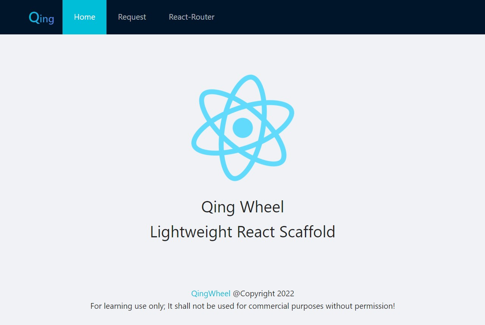

# QingWheel/轻轮
Lightweight React Scaffold/轻量级React脚手架  
  

## 目标群体
React初学者的入门示例  
个人开发者的提效工具   
中小团队的规范协同
## 版本
React18 + React-Router6  
进阶Redux版请移步qw-react-router-redux(开发中)  
当前为JS版，后续会支持TS
## 背景
当你从零开始搭建React脚手架时，有木有觉得很繁琐  
create-react-app配置隐晦，xx企业级框架过于厚重  
一些前端的内卷，已经卷到了造很多重复的轮子，来凸显自身价值  
大量的业务封装，让你脱离了公司框架，忘记了纯净的React体系是啥样

轻轮，0糖0私货，不造假轮子，安心拧螺丝！  
## 起步
前端新手请参考[萌新指南](./docs/MENG_XIN.md)  
使用时，先fork或者自己新建一个空的git工程，然后迁移代码  
安装过程如有异常请提issue，会定期更新在[常见问题](./docs/Q%26A.md)
## 运行环境
截至目前的Node LTS版本运行稳定，低版本没测。  
测了有问题也不要提issue，不考虑向下兼容。  
问就是建议升级。
```
node -v // 16.16.0
npm -v // 8.11.0
```
## 运行项目
参考package.json中的script
```
启动开发环境：npm start(监控配置模式)
// 上述模式会监控webpack配置，自动重启服务，需要全局安装nodemon)
// npm i -g nodemon
启动开发环境：npm run dev(常规模式)
构建测试环境：npm run qa
构建正式环境：npm run prod
```
## 技术架构
```
基础框架：React(v18+)
路由管理：React-Router(v6+)
UI组件库：antd(v4+)
打包构建：Webpack(v5+)
CSS预处理：Less + PostCSS
代码检查：ESLint + Stylelint
格式美化：Prettier
Git规范：Commitlint + Husky + Lint-staged
```
## 注意
仅供学习使用；未经授权不得用于商业用途